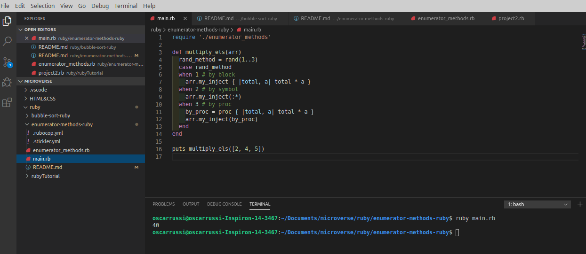

# enumerator-methods-ruby

Second Ruby Microverse Project By Oscar Russi

# Bubble sort on Ruby 

Second Microverse project for Ruby Curriculum

# What it does

- Extend Enumerable module to add methods which simulate the behavior of other Enumerable methods. 
- Create my own each method to make work all the other enumerable methods that I created
- Extending Enumerable module to add more methods that received both arrays and ranges
- multiply_els in main.rb
- Using yield and call method as it was required
- my_inject method receive the next symbols (+, -, *, /, **, & and ||)

## Built With

- Ruby

#### and deployed to GitHub

## Live Demo

[Live Demo](https://repl.it/@yoxter3423/enumerator-methods-ruby) (not working until merge with master)

## Authors

**Oscar Russi**
- Github: [@andresporras3423](https://github.com/andresporras3423/)
- Linkedin: [Oscar Russi](https://www.linkedin.com/in/oscar-andr%C3%A9s-russi-porras-053236167/)

## 🤝 Contributing

This is a project for educational purposes only. We are not accepting contributions.

## Attributions and Credit

Special thanks to Microverse, for this learning opportunity. 

## Show your support

Give a ⭐️ if you like this project!

## Enjoy!
